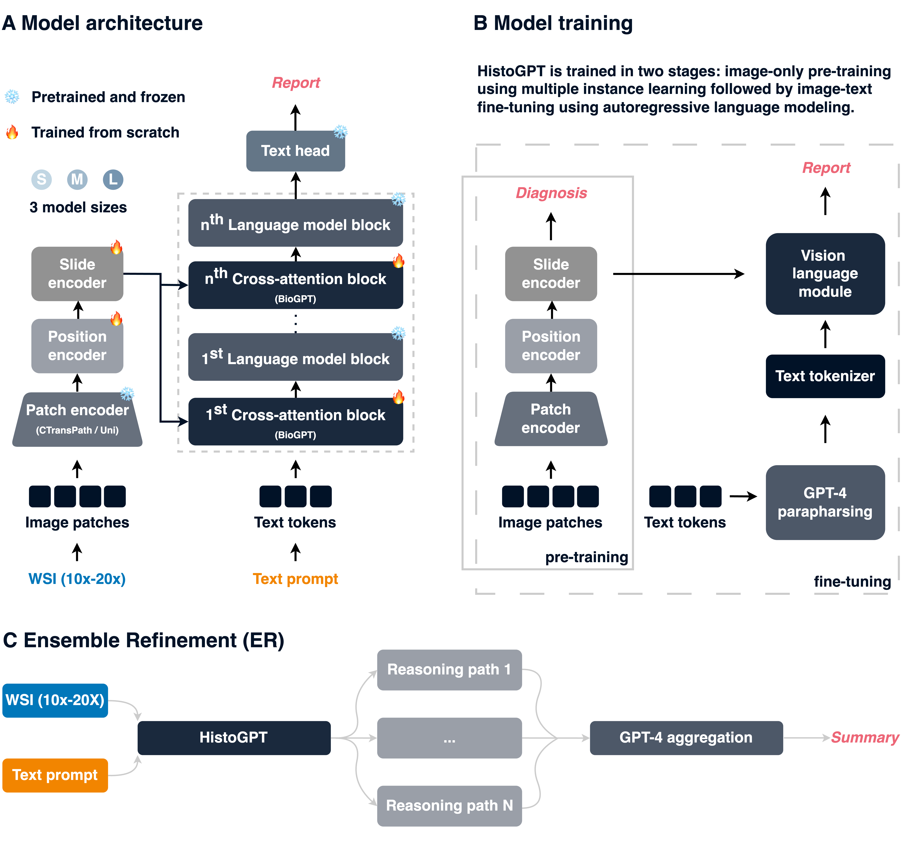

# HistoGPT

[[medRxiv]()] [[huggingface](https://huggingface.co/marr-peng-lab/histogpt)]

## Generating highly accurate histopathology reports from whole slide images

HistoGPT is a vision language foundation model for dermatopathology. The model takes multiple tissue sections from a patient as input and generates a highly accurate pathology report that includes the disease classification, tumor subtype prediction, tumor thickness estimation, and other important clinical information. Most importantly, HistoGPT is fully interpretable, as every word or phrase in the output text can be visualized in the original image.


## HistoGPT learns from vision and language
HistoGPT takes an whole slide image as input, tiles it into smaller image patches, extracts the feature vectors for each image patch with an image encoder, reduces the number of feature vectors to a fixed size with a Perceiver Resampler, and combines them with text features coming from a language model via interleaved cross-attention layers.



## HistoGPT is trained on over 10TB of data

We trained HistoGPT on a large-scale dataset of 6,000 patient-report pairs from over 12,000 whole slide images (WSIs) of over 150 different skin conditions (healthy, inflammatory, cancerous, ...) provided by the Department of Dermatology at the Technical University of Munich (TUM). To test our model, we extensively evaluated HistoGPT on five external cohorts from five different countries, including a dataset of 1,300 patient-report pairs from the Department of Dermatology at the University Hospital Münster (UKM).

## HistoGPT simple and easy to use

The forward pass of the model looks like this
```python
import torch
from transformers import BioGptConfig
from histogpt.models import HistoGPTForCausalLM, PerceiverResamplerConfig

histogpt = HistoGPTForCausalLM(BioGptConfig(), PerceiverResamplerConfig())

text = torch.randint(0, 42384, (1, 256))
image = torch.rand(1, 1024, 768)

print(histogpt(text, image).logits.size())
```

## ToDo
Make repository ready for publication!
